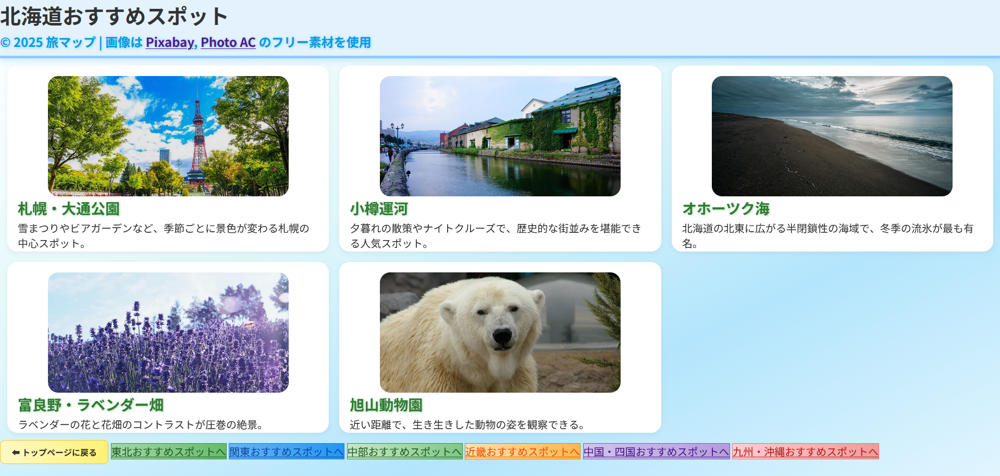
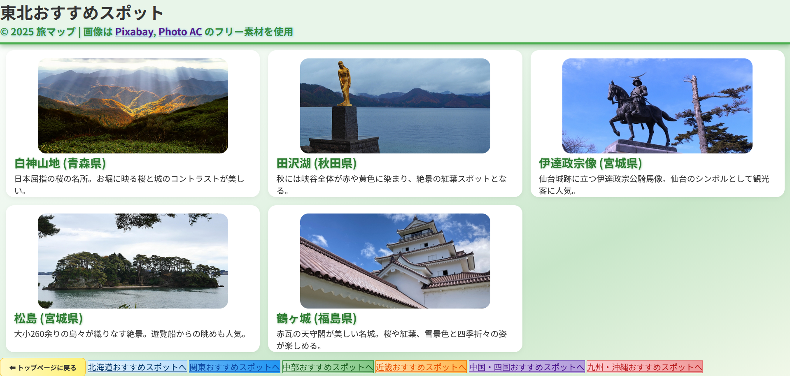
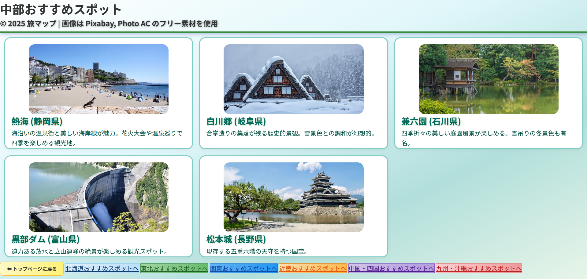
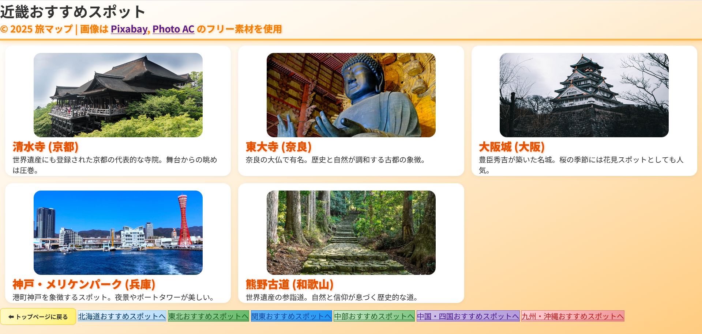
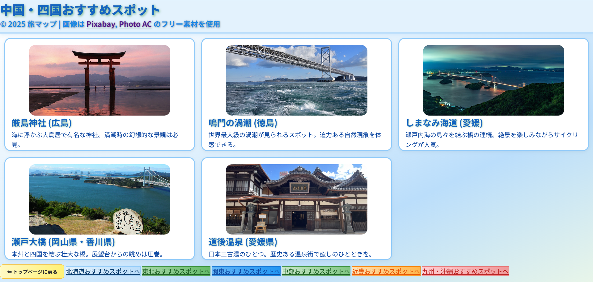
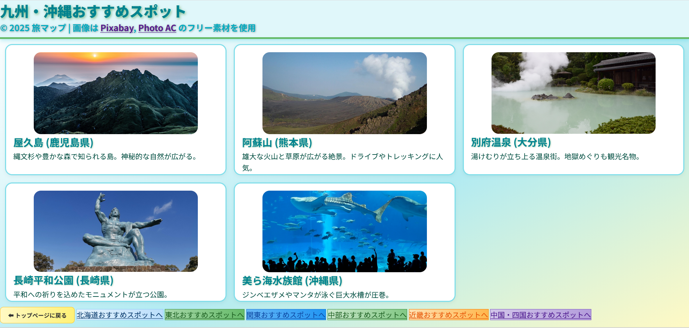

### Japan Travel Map

## 概要
Japan Travel Map は、日本全国のおすすめスポットを紹介するWebサイトです。北海道から沖縄まで全国をカバーし、統一されたデザインとレスポンシブ対応により、PC・タブレット・スマートフォンから快適に閲覧できます。商用サイトのような予約機能や広告はなく、純粋に「見やすさ」「使いやすさ」「アクセシビリティ」を重視した作品です。情報量よりもUIの統一性や操作性を大切にし、全国を一貫したデザインで表現しています。サイトのスクリーンショットや地域ページの画像をアップロードしており、GitHubリポジトリからもご覧いただけます。

## 制作背景

Web制作の基礎を学びながら、実務に近い環境で成果物を構築することを目的として制作しました。GitHubでのバージョン管理、VS Codeでの開発、Chrome DevToolsによるレスポンシブ検証を取り入れ、学習段階ながらも現場を意識した制作を行っています。単なる練習ではなく、ポートフォリオとして公開できる水準を目指しました。また、自分自身が旅行が好きで、日本各地の魅力をまとめたいと思ったことがきっかけで、学習の一環でありながら、趣味と実務をつなげる形で制作しました。ポートフォリオ上ではスクリーンショット数の制約によりトップページ（index.html）のみを掲載していますが、実際には全国各地域ごとのページを制作済みです。全ページはGitHubリポジトリにアップロードしており、コードやデザインを直接ご確認いただけます。

## 使用技術

HTML5
CSS3（Flexbox, Grid, レスポンシブデザイン）
外部CSS + 地域別内部CSS
GitHub（バージョン管理・公開）
VS Code（開発環境）

## 特徴

統一デザイン：グリッド・カード構造を全地域で共通化し、全国を一貫したUIで表現
地域カラー：各地域ごとに背景グラデーションやボタン色を設定し、視覚的に差別化
アクセシビリティ：全画像にalt属性を設定し、誰でも利用しやすい構造を意識
ナビゲーション：フッターから全国の各地域ページへ移動可能

ページ一覧

## index.html : トップページ（全国の地域へナビゲーション）

## hokkaido.html : 北海道おすすめスポット

## tohoku.html : 東北おすすめスポット

## kanto.html : 関東おすすめスポット

## chubu.html : 中部おすすめスポット

## kinki.html : 近畿おすすめスポット

## chugoku-shikoku.html : 中国・四国おすすめスポット

## kyushu-okinawa.html : 九州・沖縄おすすめスポット

## assets/css/style-home.css : 共通CSS

### 今後の改善予定

CSSの外部化と整理（地域ごとにファイル分割し、保守性を高める）

HTML構造やCSSセクションの順序統一で可読性向上

画像の最適化（サイズ圧縮やWebP対応で表示速度改善）

READMEの多言語対応（英語版READMEを追加予定）

.gitignore整備（不要ファイルを除外し、リポジトリをクリーンに保つ）

まとめ

「Japan Travel Map」は、全国のおすすめスポットを紹介しながら、統一されたデザインとレスポンシブ対応を重視したWebサイトです。学習段階ながらもGitHub公開や実務に近い環境で制作しており、今後の改善を通じてさらに完成度を高めていく予定です。
